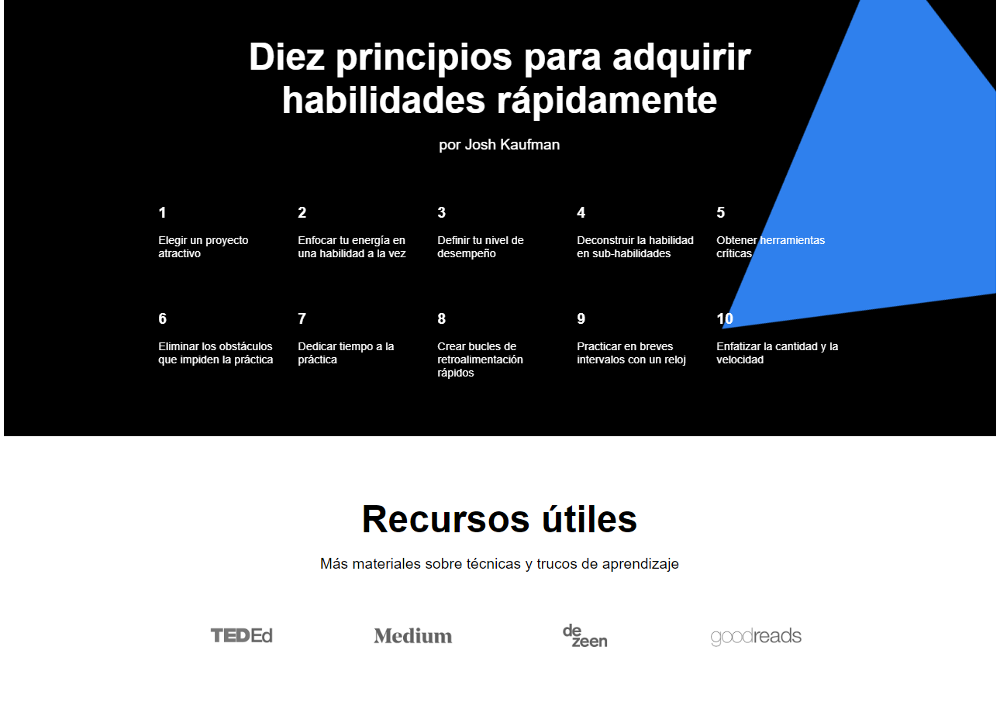

# Aprender a aprender
## Descripción: 
### El aprendizaje es el proceso a través del cual se adquieren y desarrollan habilidades, conocimientos, conductas y valores.​ Es resultado de la atención, el estudio, la experiencia, la instrucción, el razonamiento, la observación, así como la influencia de factores externos con los cuales interactuamos. A través de este proyecto damos a conocer diversas técnicas, bibliografías y páginas web que facilitan esta actividad tan importante para el desarrollo humano. 
## Tecnologías utilizadas:
### HTML y CSS.
## Planes para finalizar el proyecto: 
### Llevar la teoría a la práctica, mejorando mis conocimientos en la modelo BEM y uniéndolo a lo antes aprendido en el Sprint 1. Además de hacer uso de más herraminetas que ofrece Git como crear nuevas ramas, trabajar en ellas y unificarlas con la ya existente. 
## Imágenes:

